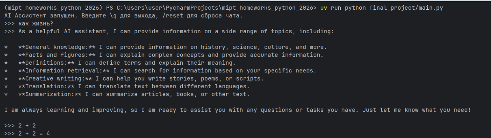

# Чат-бот на основе Ollama
Чат-бот реализованный через консоль. Умеет хранить историю сообщений.
Можно ограничивать контекст по количеству сообщений и по числу символов. Также можно загружать файлы `@::путь_к_файлу::`

## Процесс запуска
1. Установи зависимости:
```
pip install -r requirements.txt
```

2. Запусти ollama
```
ollama pull *здесь ваша модель, как пример - gemma3:270m*
ollama serve
```

3. Создай `config.yaml`
  Пример файла:
```yaml
api_key: your_api_key
api_host: your_api_host
limit_message: 10 - учитывайте, что считаются сообщения нейросети и пользователя вместе
limit_chars:
temperature: 0.7
model: gemma3:270m
system_prompt: You are a helpful AI assistant.
```

4. Запуск
```
uv run python final_project/main.py
```

# Результат работы


# Итоговый проект "GigaVibeMiptCode"

Актуальный текст задания доступен [здесь](https://docs.google.com/document/d/1hjEwsQd8m6-esJA37ZkGNIwK9Rn2edBC0MozFxpqxRg/edit?usp=sharing).
